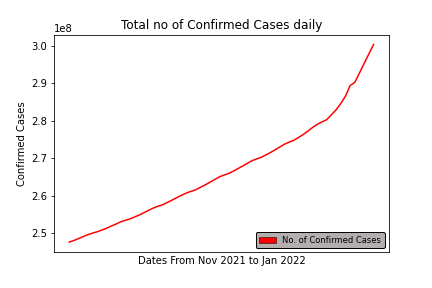
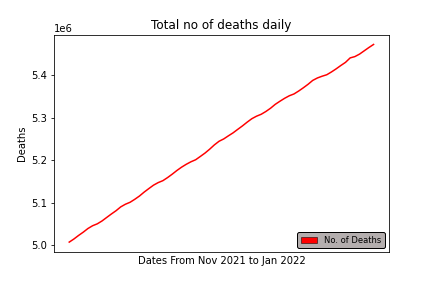
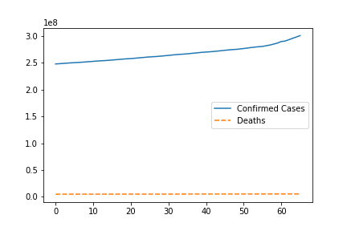

# Omicron Analysis

In this jupyter notebook, I have taken dataset from , preprocessed and analysed in order to plot graphs which show some mind blowing trends.

### Total no. of Confirmed Cases Worldwide plotted daily for the month of Nov 2021, Dec 2021 and Jan 2022

### Total no. of Deaths Worldwide plotted daily for the month of Nov 2021, Dec 2021 and Jan 2022

### Total Deaths vs Total Confirmed Cases Worldwide plotted daily for the month of Nov 2021, Dec 2021 and Jan 2022

This analysis is vital as it infers that the total no. of confirmed cases are rising signifiacntly whilst the no. of deaths are constant, which means that the mangitude of deadliness of the omicron is very low and if proper precautions are taken, third wave can be easily controlled before it shows any catostrophic behaviour.
